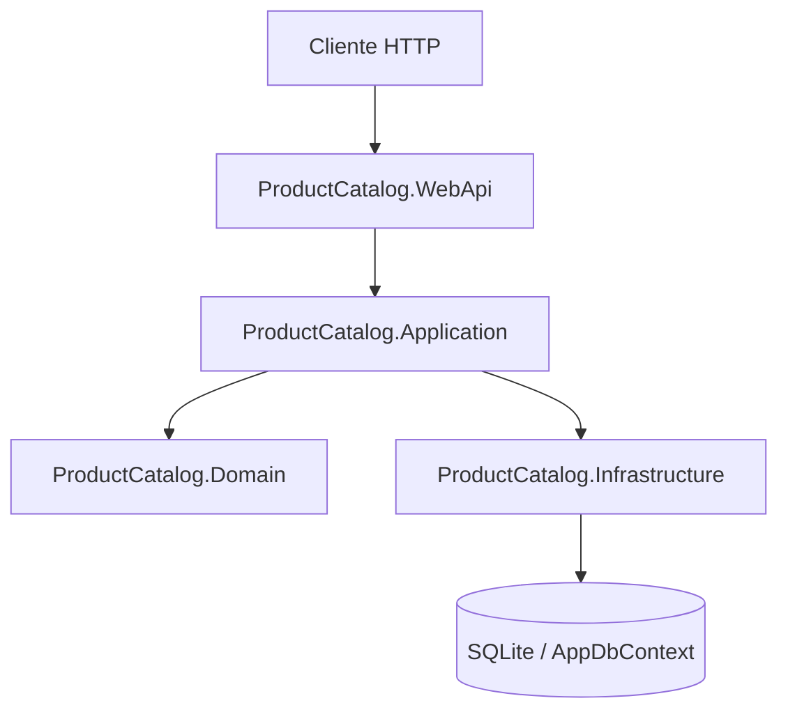
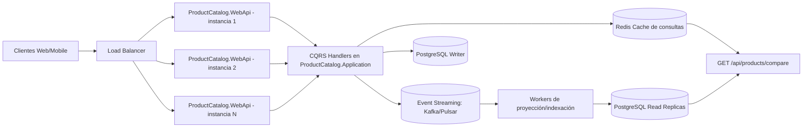

# ProductCatalog API

Implementación de **Clean Architecture + CQRS** en **.NET 8** para gestión y comparación dinámica de productos.

## 1. Overview

ProductCatalog es una API REST enfocada en:
- gestión de productos (CRUD),
- comparación dinámica de múltiples productos por atributos seleccionables,
- diseño mantenible y extensible para escenarios de evolución técnica.

## 2. Architecture

El proyecto separa la lógica de negocio de la infraestructura siguiendo Clean Architecture:

```text
src/
 ├── ProductCatalog.WebApi
 ├── ProductCatalog.Application
 ├── ProductCatalog.Domain
 └── ProductCatalog.Infrastructure
```

### Capas

**Domain**
- Núcleo de negocio (entidades y reglas).
- Sin dependencias de frameworks de infraestructura.

**Application**
- Casos de uso y flujo CQRS (commands, queries, handlers, DTOs).
- Orquestación de lógica de aplicación.

**Infrastructure**
- Persistencia y componentes técnicos.
- EF Core + SQLite para almacenamiento del challenge.

**WebApi**
- Entrada HTTP (controllers, middleware, DI, Swagger).

### Flujo de ejecución

```text
HTTP Request
   ↓
Controller (WebApi)
   ↓
Command / Query Handler (Application)
   ↓
Domain
   ↓
Infrastructure (Database)
```

## 3. Tech stack

| Componente | Tecnología |
|---|---|
| Runtime | .NET 8 |
| API Framework | ASP.NET Core Web API |
| Arquitectura | Clean Architecture |
| Persistencia | Entity Framework Core + SQLite |
| Testing | xUnit + WebApplicationFactory |
| API Docs | Swagger / OpenAPI |

En este proyecto .NET se usa **`WebApplicationFactory<Program>`**, para pruebas de integración end-to-end de la API.

## 4. Main endpoints

Base path: `/api/products`

### CRUD de productos

| Método | Endpoint | Descripción |
|---|---|---|
| GET | `/api/products` | Lista productos |
| GET | `/api/products/{id}` | Obtiene un producto por id |
| POST | `/api/products` | Crea producto |
| PUT | `/api/products/{id}` | Actualiza producto |
| DELETE | `/api/products/{id}` | Elimina producto |

### Comparación dinámica de productos

`GET /api/products/compare`

Permite comparar múltiples productos en una sola llamada y elegir qué atributos devolver.

#### Parámetros

- `ids` (**requerido**): GUIDs separados por coma.
  - mínimo: 2
  - máximo: 10
- `fields` (opcional): lista de campos a comparar.
  - si no se especifica, se aplica set por defecto.

#### Campos permitidos

`description`, `imageUrl`, `price`, `rating`, `size`, `weight`, `color`, `specifications`, `batteryCapacity`, `cameraSpecifications`, `memory`, `storageCapacity`, `brand`, `modelVersion`, `operatingSystem`

#### Ejemplo de request

```bash
curl "https://localhost:5001/api/products/compare?ids=11111111-1111-1111-1111-111111111111,22222222-2222-2222-2222-222222222222&fields=price,rating,batteryCapacity"
```

#### Ejemplo de respuesta

```json
{
  "fields": ["price", "rating", "batteryCapacity"],
  "items": [
    {
      "id": "11111111-1111-1111-1111-111111111111",
      "name": "Smartphone X",
      "attributes": {
        "price": 999.99,
        "rating": 4.7,
        "batteryCapacity": "5000mAh"
      }
    },
    {
      "id": "22222222-2222-2222-2222-222222222222",
      "name": "Smartphone Y",
      "attributes": {
        "price": 849.99,
        "rating": 4.5,
        "batteryCapacity": "4600mAh"
      }
    }
  ]
}
```

## 5. Design decisions

- **Modelo híbrido común + specifications** para mantener el diseño extensible.
- **Filtrado por `fields`** para traer solo atributos relevantes en comparación.
- **Manejo global de errores** en middleware (traducción consistente a HTTP status).
- **Persistencia simulada/local** para facilitar ejecución del challenge.

### Mapa de módulos y capas



- **WebApi**: capa de entrada HTTP.
- **Application**: casos de uso CQRS y orquestación.
- **Domain**: reglas de negocio puras.
- **Infrastructure**: persistencia y componentes técnicos.

### Observabilidad básica

1. Correlation ID por request (`X-Correlation-Id`) para trazabilidad.
2. Logging estructurado (campos sugeridos: `timestamp`, `level`, `path`, `method`, `statusCode`, `elapsedMs`, `exception`).
3. Log de inicio/fin de request con latencia para detectar cuellos de botella.

### Manejo de errores

- `InvalidOperationException` -> `400 Bad Request`
- `KeyNotFoundException` -> `404 Not Found`
- `Exception` -> `500 Internal Server Error`

Casos típicos:
- campo inválido en `fields` -> `400`
- IDs inexistentes -> `404`
- más de 10 IDs para comparar -> `400`

## 6. Run instructions

```bash
dotnet restore
dotnet run --project src/ProductCatalog.WebApi
```

Swagger disponible en: `/swagger` (Development).

## 7. Testing

```bash
dotnet test
```

Incluye:
- unit tests para lógica de comparación,
- integration tests HTTP del endpoint `/api/products/compare` con `WebApplicationFactory<Program>`.

## 8. Future improvements

## Escalabilidad (objetivo: 100k transacciones por segundo)

Para soportar este volumen, la estrategia recomendada combina:

1. **Load balancing**
   - Balanceadores L4/L7 al frente del API Gateway para distribuir tráfico horizontalmente.
   - Health checks y auto-scaling por métricas de latencia/CPU/RPS.

2. **Stateless services**
   - Servicios sin estado para escalar por réplica sin afinidad de sesión.
   - Estado externalizado en Redis/DB/event store.

3. **Caching**
   - Redis para lecturas frecuentes, reglas precompiladas y resultados temporales.
   - TTL, invalidación por eventos y protección ante cache stampede.

4. **Event streaming**
   - Kafka/Pulsar/Kinesis para desacoplar ingestión, evaluación de reglas y persistencia.
   - Procesamiento asíncrono, particionado por clave y consumer groups para paralelismo.

### Cómo quedaría la gráfica de alto nivel para 100k TPS



- Las escrituras (`POST/PUT/DELETE`) van al **writer** y publican eventos.
- Las lecturas de alta frecuencia (`GET` y `compare`) priorizan **Redis + read replicas** para sostener alto TPS.
- El escalado horizontal ocurre en `ProductCatalog.WebApi` por ser stateless.
