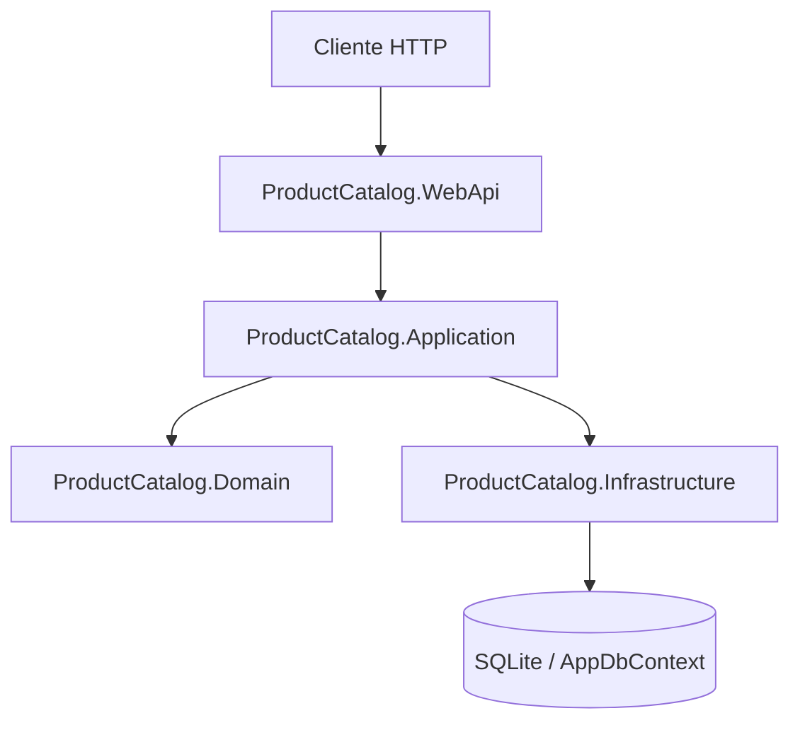

# ProductCatalog - Clean Architecture + CQRS (.NET)

Solución ASP.NET Core Web API con arquitectura limpia y patrón CQRS para la entidad `Product`.

## Estructura

- `ProductCatalog.Domain`: entidades de dominio.
- `ProductCatalog.Application`: contratos (repository/service), CQRS (commands, queries, handlers), DTOs.
- `ProductCatalog.Infrastructure`: EF Core + SQLite, repositorio y servicio.
- `ProductCatalog.WebApi`: controlador REST y configuración del host.


## Mapa de módulos y capas del desarrollo (cómo leerlo)



- **WebApi**: capa de entrada HTTP (controllers, middleware, configuración del host).
- **Application**: casos de uso CQRS, DTOs y dispatchers (orquestación).
- **Domain**: reglas/entidades de negocio puras.
- **Infrastructure**: persistencia y servicios técnicos (EF Core, repositorios).
- **Lectura del flujo**: izquierda a derecha/arriba abajo → request entra por WebApi, Application ejecuta lógica, y Infrastructure resuelve I/O (DB).

## Observabilidad básica (challenge)

1. **Correlation ID por request (trazabilidad mínima)**
   - Leer/generar `X-Correlation-Id` en middleware.
   - Propagarlo en logs y devolverlo en el response header para seguimiento end-to-end.

2. **Logging estructurado en JSON**
   - Estandarizar logs con campos: `timestamp`, `level`, `correlationId`, `path`, `method`, `statusCode`, `elapsedMs`, `exception`.
   - Facilita búsquedas, dashboards y alertas.

3. **Log de inicio/fin de request con latencia**
   - Registrar un log al inicio y otro al final de cada request.
   - Medir `elapsedMs` para detectar endpoints lentos (p95/p99) rápidamente.

## Escalabilidad (objetivo: 100k transacciones por segundo)

Para soportar este volumen, la estrategia recomendada combina:

1. **Load balancing**
   - Balanceadores L4/L7 al frente del API Gateway para distribuir tráfico horizontalmente.
   - Health checks y auto-scaling por métricas de latencia/CPU/RPS.

2. **Stateless services**
   - Servicios sin estado para escalar por réplica sin afinidad de sesión.
   - Estado externalizado en Redis/DB/event store.

3. **Caching**
   - Redis para lecturas frecuentes, reglas precompiladas y resultados temporales.
   - TTL, invalidación por eventos y protección ante cache stampede.

4. **Event streaming**
   - Kafka/Pulsar/Kinesis para desacoplar ingestión, evaluación de reglas y persistencia.
   - Procesamiento asíncrono, particionado por clave y consumer groups para paralelismo.

### Cómo quedaría la gráfica de alto nivel para 100k TPS

```mermaid
flowchart LR
    U[Clientes / Comercios] --> LB[Load Balancer]
    LB --> G1[API Gateway - instancia 1]
    LB --> G2[API Gateway - instancia 2]
    LB --> G3[API Gateway - instancia N]

    G1 --> F[Fraud Detection Service (Stateless)]
    G2 --> F
    G3 --> F

    F --> R[Rule Engine Cluster]
    R --> C[(Redis Cache)]
    R --> ES[(Event Streaming: Kafka/Pulsar)]
    ES --> W[Workers de evaluación/persistencia]
    W --> DB[(PostgreSQL Cluster)]
```

## CRUD de productos

Endpoints disponibles en `api/products`:

- `GET /api/products`
- `GET /api/products/{id}`
- `GET /api/products/compare?ids={id1},{id2}&fields=price,rating,color`
- `POST /api/products`
- `PUT /api/products/{id}`
- `DELETE /api/products/{id}`

`fields` es opcional en `compare`. Si se omite, la API devuelve un set por defecto de campos útiles para comparación.

## Comparación de productos (`GET /api/products/compare`)

### Parámetros

- `ids` (**obligatorio**): lista de GUIDs separada por coma.
  - Mínimo: 2 IDs.
  - Máximo: 10 IDs.
- `fields` (opcional): lista de campos separada por coma.
  - Si no se envía, se usan campos por defecto.

### Campos permitidos en `fields`

`description`, `imageUrl`, `price`, `rating`, `size`, `weight`, `color`, `specifications`, `batteryCapacity`, `cameraSpecifications`, `memory`, `storageCapacity`, `brand`, `modelVersion`, `operatingSystem`

### Campos por defecto (cuando `fields` no se envía)

`description`, `imageUrl`, `price`, `rating`, `size`, `weight`, `color`, `specifications`

### Ejemplo de request (curl)

```bash
curl "https://localhost:5001/api/products/compare?ids=11111111-1111-1111-1111-111111111111,22222222-2222-2222-2222-222222222222&fields=price,rating,batteryCapacity"
```

### Ejemplo de response `200 OK`

```json
{
  "fields": ["price", "rating", "batteryCapacity"],
  "items": [
    {
      "id": "11111111-1111-1111-1111-111111111111",
      "name": "Smartphone X",
      "attributes": {
        "price": 999.99,
        "rating": 4.7,
        "batteryCapacity": "5000mAh"
      }
    },
    {
      "id": "22222222-2222-2222-2222-222222222222",
      "name": "Smartphone Y",
      "attributes": {
        "price": 849.99,
        "rating": 4.5,
        "batteryCapacity": "4600mAh"
      }
    }
  ]
}
```

### ¿Qué pasa en casos inválidos?

- **Campo inválido en `fields`** (ej. `fields=price,noExiste`)  
  Respuesta: `400 Bad Request` con mensaje de validación indicando cuáles campos no están permitidos.
- **Producto inexistente en `ids`** (GUID válido pero no encontrado)  
  Respuesta: `404 Not Found` con mensaje indicando qué IDs no existen.
- **Más de 10 IDs en `ids`**  
  Respuesta: `400 Bad Request` indicando el máximo permitido para comparación.

## Base de datos

Se usa SQLite con connection string:

```json
"DefaultConnection": "Data Source=productcatalog.db"
```

Al iniciar la API se ejecuta `Database.EnsureCreated()` para crear la base si no existe.
Además, se cargan productos de ejemplo automáticamente si la tabla está vacía.

## Ejecutar

```bash
dotnet restore
dotnet run --project src/ProductCatalog.WebApi
```

Swagger queda disponible en `/swagger` en entorno Development.

## Ejecutar tests

```bash
dotnet test
```

Incluye:
- unit tests de `CompareProductsQueryHandler`.
- integration tests HTTP del endpoint `/api/products/compare` usando `WebApplicationFactory<Program>`.

## Manejo de errores

La API utiliza un middleware global para transformar excepciones comunes a respuestas HTTP:

- `InvalidOperationException` -> `400 Bad Request`
- `KeyNotFoundException` -> `404 Not Found`
- `Exception` -> `500 Internal Server Error`

## Decisiones de diseño (challenge)

- La comparación se resuelve por query params: `ids` (obligatorio) y `fields` (opcional).
- Si `fields` no se envía, el backend responde con un set por defecto de atributos de comparación.
- Se valida que existan al menos 2 productos para comparar y que todos los `ids` existan.
